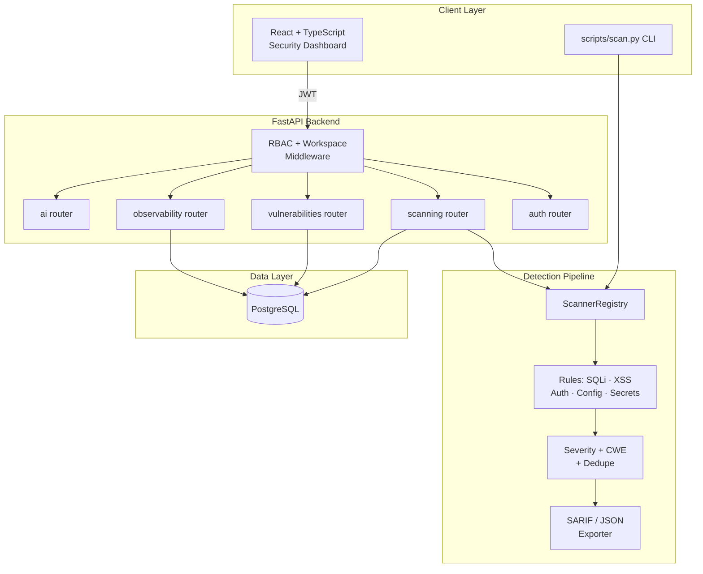

# Obsidian

**Secure Application & Vulnerability Scanning Platform**

[**🔗 View Live Preview →**](https://www.perplexity.ai/computer/a/obsidian-preview-project-7-of-lCA5DWRgQoa4AN6VYPXAUQ)

> A full-stack educational AppSec project: a FastAPI + React platform with
> JWT/RBAC, a rule-based vulnerability scanner mapped to OWASP Top 10, a
> security dashboard, and a CLI suitable for CI/CD policy gates.

---

## 👋 Elevator pitch

Most security tutorials teach you how to break things. Obsidian is built from
the defender's side — it shows what the *inside* of a security platform looks
like: auth hardening, role-based access control, a rule-registry scan
pipeline with severity/CWE/OWASP tagging, and a dashboard that turns scan
findings into a triageable workflow.

## 🧑‍💼 For recruiters & hiring managers

**What this project is:** a portfolio-grade AppSec / DevSecOps demonstration
built by a University of Maryland Information Science undergraduate. It is
**not** a production tool or commercial product.

**What it shows:**

- Working knowledge of the **OWASP Top 10 (2021)** mapped to concrete rules
  (`docs/owasp-mapping.md`).
- A real FastAPI backend with **JWT auth, refresh tokens, RBAC, password
  policy, lockout, and security headers**.
- A **rule-registry vulnerability scanner** with severity scoring,
  CWE tagging, dedupe keys, and three depth profiles (quick / standard / deep).
- **DevSecOps muscle:** GitHub Actions CI running `ruff`, `bandit`, `mypy`,
  and `pytest`; a CLI `--fail-on <severity>` policy gate; SARIF/JSON exports.
- Honest, written-up **limitations** and **future work** (`ETHICS.md`,
  `docs/owasp-mapping.md`) rather than overclaiming.

Short resume bullets are in **[`docs/resume-bullets.md`](docs/resume-bullets.md)**.

---

## 🎯 Problem & value

| | |
|---|---|
| **Problem** | Application security findings often live in scanner output that engineers ignore — no triage workflow, no role-aware access, no CI gate, no audit trail. |
| **Approach** | A unified platform where scans, findings, and remediation state are first-class data, exposed through an API and a dashboard, and enforced via RBAC and audit logging. |
| **Value (educational)** | Shows end-to-end ownership of a secure full-stack feature: schema → service → API → UI → CI gate → docs. |

---

## ✨ Features

- **JWT authentication** — register / login / refresh / logout / me, with
  bcrypt hashing and password policy enforcement.
- **RBAC** — `admin`, `security_analyst`, `developer`, `viewer`, enforced at
  the API dependency layer; multi-tenant workspace scoping with a `wid` JWT
  claim and cross-workspace request blocking.
- **Rule-based scanner** — 10+ rules covering SQLi, XSS, secret leakage,
  sensitive-data exposure, insecure auth, broken access control, insecure
  config, insecure HTTP headers, auth misconfiguration, and container/k8s
  config-hardening checks (see `backend/app/services/scanner_engine.py`).
- **OWASP Top 10 mapping** — each rule tagged with OWASP 2021 category,
  CWE ID, severity, and confidence (see `docs/owasp-mapping.md`).
- **Severity scoring** — `critical / high / medium / low`, plus
  finding-level confidence and stable dedupe keys.
- **Remediation guidance** — every rule ships with a remediation tip and a
  secure-example snippet; `/scanning/{scan_id}/remediation-checklist`
  generates a developer-facing checklist.
- **Policy gate for CI/CD** — `/scanning/{scan_id}/policy-gate` endpoint
  plus a standalone CLI (`scripts/scan.py --fail-on high`).
- **SARIF & JSON reports** — exportable findings for engineering workflows.
- **Audit logging** — account creation, login events, scan activity.
- **React + TypeScript dashboard** — posture metrics, vulnerability table,
  scan history, and remediation workflow.
- **Docker Compose** — one-command local stack.
- **CLI scanner** — `python scripts/scan.py data/samples/sqli_payload.txt`
  works without the FastAPI stack.

---

## 🛠️ Tech stack

| Layer | Technology |
|---|---|
| Backend API | FastAPI · SQLAlchemy · PostgreSQL · Pydantic |
| Auth | JWT (access + rotating refresh) · RBAC · bcrypt |
| Scanning | Python rule registry · regex detectors · OWASP/CWE tagging |
| Frontend | React · Vite · TypeScript · Tailwind CSS |
| DevSecOps | GitHub Actions · ruff · bandit · mypy · pytest |
| Infra | Docker Compose |

---

## 🏗️ Architecture



See **[`docs/architecture.md`](docs/architecture.md)** for the full architecture write-up.

---

## 📁 Repository structure

```
.
├── backend/                FastAPI API, auth, RBAC, scan engine, models, tests
│   ├── app/
│   │   ├── routers/        auth, scanning, vulnerabilities, app_data
│   │   ├── services/       scanner_engine, auth, scanning, audit, alerts, AI
│   │   ├── models/         scans, findings, users, workspaces, audit logs
│   │   └── schemas/        Pydantic request/response models
│   └── tests/              pytest suite (scanner unit, auth/RBAC, pipeline, API)
├── frontend/               React + Vite + TypeScript dashboard
├── scripts/
│   └── scan.py             Standalone CLI wrapper around the scanner engine
├── data/
│   ├── samples/            Intentionally insecure sample inputs
│   └── reports/            Frozen example scan output
├── docs/
│   ├── architecture.md     Architecture & phase notes
│   ├── api.md              API surface reference
│   ├── owasp-mapping.md    OWASP Top 10 coverage matrix
│   ├── resume-bullets.md   ATS-friendly resume bullets
│   └── demo-runbook.md     10-minute demo script
├── tests/                  Top-level tests for the CLI
├── docker-compose.yml
├── Makefile
├── SECURITY.md
├── ETHICS.md               Intended use & limitations
└── README.md
```

---

## 🚀 Setup

### Prerequisites
- Docker + Docker Compose
- Python 3.11+
- Node.js 20+

### Docker (recommended)

```bash
cp backend/.env.example backend/.env
cp frontend/.env.example frontend/.env
make up
# Frontend:         http://localhost:3000
# Backend API docs: http://localhost:8000/docs
```

### Local development

```bash
# Backend
python -m venv .venv && source .venv/bin/activate
pip install -r backend/requirements.txt
uvicorn app.main:app --app-dir backend --reload

# Frontend
cd frontend && npm install && npm run dev
```

### Environment variables

See `backend/.env.example`. Key vars:

| Var | Purpose |
|---|---|
| `JWT_SECRET_KEY` | **Must be replaced** before any deployment |
| `POSTGRES_*` | Database connection |
| `ENVIRONMENT` | `development` / `production` |
| `LOG_LEVEL` | Logging verbosity |
| `ALERT_WEBHOOK_URL` | Optional webhook for critical findings |

---

## 🎬 Demo workflow

### Option A — CLI only (no Docker required)

```bash
# Scan a bundled SQLi sample, table output
python scripts/scan.py data/samples/sqli_payload.txt

# Scan an insecure config with deep profile, JSON output
python scripts/scan.py --profile deep --json data/samples/insecure_config.yaml

# CI-style gate: exit 1 if any high-severity finding
python scripts/scan.py --fail-on high data/samples/sqli_payload.txt

# Read from stdin
echo "debug=true" | python scripts/scan.py -
```

### Option B — Full stack

See **[`docs/demo-runbook.md`](docs/demo-runbook.md)** for a 10-minute walkthrough.

### Example API flow

```bash
# 1. Register
curl -X POST http://localhost:8000/api/v1/auth/register \
  -H 'Content-Type: application/json' \
  -d '{"email":"analyst@example.com","password":"StrongPassw0rd!","role":"security_analyst"}'

# 2. Login
TOKEN=$(curl -s -X POST http://localhost:8000/api/v1/auth/login \
  -H 'Content-Type: application/json' \
  -d '{"email":"analyst@example.com","password":"StrongPassw0rd!"}' | jq -r .access_token)

# 3. Run a scan
curl -X POST http://localhost:8000/api/v1/scanning/run \
  -H "Authorization: Bearer $TOKEN" \
  -H 'Content-Type: application/json' \
  -d '{"target":"https://demo.local/login","payload":"\" OR 1=1 -- <script>alert(1)</script>"}'
```

---

## 📦 Sample data & reports

- `data/samples/sqli_payload.txt` — SQLi attempt against `/api/v1/login`
- `data/samples/xss_payload.txt` — reflected XSS attempts
- `data/samples/insecure_config.yaml` — debug, wildcard CORS, default creds
- `data/samples/insecure_response.http` — missing security headers
- `data/samples/clean_request.txt` — clean negative-case input
- `data/reports/sample-scan-report.json` — frozen example output

---

## 🧪 Testing

```bash
# Standalone CLI tests (no DB required)
pytest tests/

# Full backend suite (requires Postgres or test DB env)
cd backend && pytest

# Quality gate
make ci-check
```

CI runs `ruff`, `bandit`, `mypy`, and `pytest` on every push and PR — see
[`.github/workflows/ci.yml`](.github/workflows/ci.yml).

---

## ⚠️ Limitations & future work

**Limitations**

- Detection is **static regex pattern matching** — both false positives and
  false negatives are expected.
- A04 (Insecure Design) and A09 (Logging/Monitoring) are out of scope for a
  single-payload scanner.
- A06 (Vulnerable Components) is **not** covered — there is no SBOM
  ingestion or CVE lookup yet.
- Not production-hardened: default secrets in `.env.example`, demo endpoints
  intentionally vulnerable, no production rate-limit tuning.
- This is **not** a substitute for SAST / DAST / IAST tools or professional
  penetration testing.

**Planned / future work**

- SBOM + CVE database lookup for OWASP A06.
- SSRF heuristics for OWASP A10.
- Confidence calibration against a labeled corpus.
- Optional `bandit` / `semgrep` integration alongside the regex rule set.
- Token revocation + lockout coverage parity with `auth_service`.

---

## 🛡️ Safe-use notice

Intended for **local, educational** scanning of bundled or self-owned demo
applications only. **Do not** scan systems you do not own or have explicit
written authorization to test. See [`ETHICS.md`](ETHICS.md) and
[`SECURITY.md`](SECURITY.md).

---

## 📝 Resume bullets

Short, ATS-friendly bullets are in **[`docs/resume-bullets.md`](docs/resume-bullets.md)**.

---

## 📄 License

MIT
