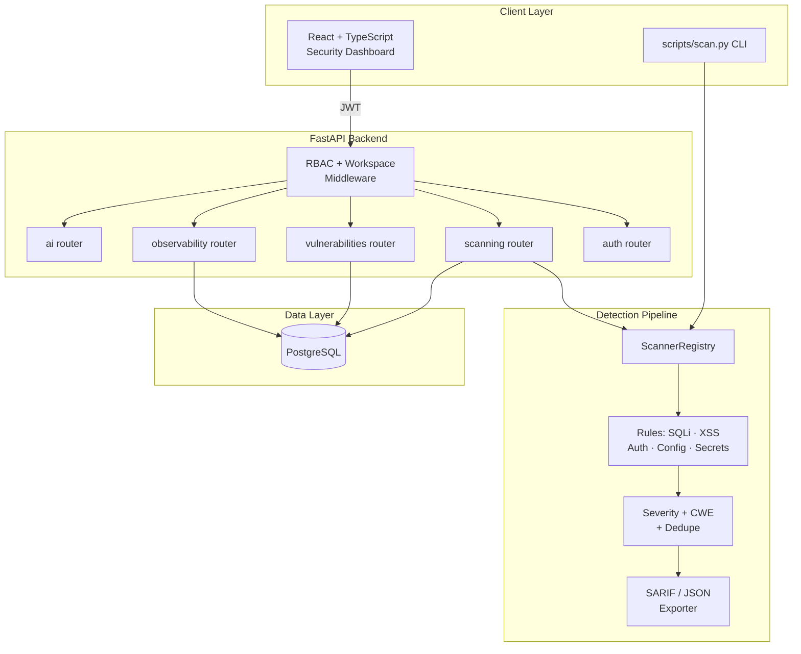

# Obsidian

**Secure Application & Vulnerability Scanning Platform** — a portfolio AppSec / DevSecOps build.

[**🎨 UI / Portfolio Design Preview →**](https://www.perplexity.ai/computer/a/obsidian-preview-project-7-of-lCA5DWRgQoa4AN6VYPXAUQ)

> A full-stack educational AppSec project: a FastAPI + React platform with
> JWT/RBAC, a rule-based vulnerability scanner mapped to OWASP Top 10, a
> security dashboard, SARIF/JSON reporting, and a CLI suitable for CI/CD
> policy gates. **Not** a replacement for professional SAST/DAST tooling or
> authorized penetration testing.

---

## 🎯 Recruiter Demo in 2 Minutes

No Docker, no DB, no setup — just Python 3.11+:

```bash
# 1. Clone
git clone https://github.com/RyanJBush/Secure-application-platform-and-vulnerability-scanner.git
cd Secure-application-platform-and-vulnerability-scanner

# 2. Install scanner deps only (no DB needed)
pip install -r backend/requirements.txt

# 3. Scan a bundled SQL injection sample
python scripts/scan.py data/samples/sqli_payload.txt

# 4. JSON export + CI-style fail-on gate
python scripts/scan.py --json data/samples/insecure_config.yaml
python scripts/scan.py --fail-on high data/samples/sqli_payload.txt ; echo "exit=$?"
```

You get a table of findings with **severity, rule key, OWASP category, CWE
ID, and evidence** — exactly what a CI/CD security gate would consume.

For a full UI walkthrough (login → scan → triage → SARIF export), see
**[`docs/demo-runbook.md`](docs/demo-runbook.md)**.

---

## 📋 Project & Technical Snapshot

| | |
|---|---|
| **Project type** | Educational AppSec portfolio build (not a commercial product) |
| **Domain** | Application security, DevSecOps, vulnerability scanning |
| **Backend** | Python 3.11 · FastAPI · SQLAlchemy · Pydantic · PostgreSQL |
| **Frontend** | React · Vite · TypeScript · Tailwind CSS |
| **Auth** | JWT (access + rotating refresh) · RBAC (4 roles) · bcrypt · password policy · lockout |
| **Scanner** | Python rule registry · regex detectors · severity + confidence + CWE + OWASP tagging |
| **Detection profiles** | `quick` · `standard` · `deep` |
| **Reporting** | SARIF · JSON · remediation checklist |
| **CI/CD** | GitHub Actions: `ruff`, `bandit`, `mypy`, `pytest`, frontend lint + build |
| **CI gate** | `--fail-on <severity>` CLI flag + `/scanning/{id}/policy-gate` endpoint |
| **OWASP Top 10 (2021)** | Partial pattern-based coverage of A01, A02, A03, A05, A07, A08 (see [`docs/owasp-mapping.md`](docs/owasp-mapping.md)) |
| **Tests** | pytest suites under `backend/tests/` and `tests/` (scanner unit, auth/RBAC, pipeline, API, CLI) |
| **Infra** | Docker Compose (frontend + backend + Postgres) |
| **License** | MIT |
| **Author** | University of Maryland Information Science undergraduate |
| **Status** | Active portfolio build · v0.x · not production-hardened |

---

## 🧑‍💼 What This Project Demonstrates

This repo is structured so a reviewer can quickly verify each claim against
real files in the codebase.

- **OWASP Top 10 (2021) literacy** — each detection rule tagged with its
  OWASP category and CWE ID, documented in [`docs/owasp-mapping.md`](docs/owasp-mapping.md)
  and implemented in `backend/app/services/scanner_engine.py`.
- **Authentication hardening** — JWT access + rotating refresh tokens,
  bcrypt password hashing, password policy, account lockout, and per-endpoint
  auth rate limiting (`backend/app/services/auth_service.py`,
  `backend/app/services/rate_limit_service.py`).
- **Authorization design** — RBAC with four roles (`admin`,
  `security_analyst`, `developer`, `viewer`) enforced at the FastAPI
  dependency layer, plus multi-tenant workspace scoping with a `wid` JWT
  claim that blocks cross-workspace access.
- **Secure web defaults** — security-headers middleware (CSP, X-Frame-Options,
  X-Content-Type-Options, no-store cache control) and request-ID propagation.
- **Rule-registry scanner architecture** — pluggable rule objects with
  severity, confidence, OWASP/CWE tags, profile gating, and stable dedupe
  keys (`backend/app/services/scanner_engine.py`).
- **DevSecOps workflow ownership** — GitHub Actions CI running `ruff`,
  `bandit`, `mypy`, and `pytest`, plus a CLI policy gate suitable for blocking
  PRs on high-severity findings (`scripts/scan.py`,
  [`.github/workflows/ci.yml`](.github/workflows/ci.yml)).
- **Reporting that engineers can consume** — SARIF + JSON exports plus an
  auto-generated remediation checklist per scan.
- **Honest framing** — written-up limitations, scope boundaries, and future
  work in [`ETHICS.md`](ETHICS.md), [`SECURITY.md`](SECURITY.md), and
  [`docs/owasp-mapping.md`](docs/owasp-mapping.md).

---

## 📸 Screenshots / Demo

UI screenshots and capture instructions live in
**[`docs/screenshots/`](docs/screenshots/)**. The intended demo coverage is:

| # | View | What it shows |
|---|---|---|
| 1 | Security dashboard | Posture KPIs, recent scans, severity breakdown |
| 2 | Scan findings table | Findings with severity, OWASP/CWE tags, dedupe keys |
| 3 | Remediation checklist | Auto-generated developer-facing fix checklist |
| 4 | SARIF / JSON export | Report download view + sample SARIF payload |
| 5 | API docs | Auto-generated FastAPI Swagger UI at `/docs` |
| 6 | CLI scan output | `python scripts/scan.py …` table + JSON modes |

See [`docs/screenshots/README.md`](docs/screenshots/README.md) for how to
capture and place them.

---

## 🔑 Key Technical Highlights

- **Rule-registry scanner** with 10+ rules covering SQLi, XSS, secret
  leakage, sensitive-data exposure, insecure auth, broken access control,
  insecure config, insecure HTTP headers, auth misconfiguration, and
  container/k8s config-hardening checks
  (`backend/app/services/scanner_engine.py`).
- **Three detection profiles** — `quick`, `standard`, `deep` — for inline
  developer use vs. nightly deep scans.
- **OWASP + CWE tagging on every finding**, with severity (`critical / high
  / medium / low`) and per-finding confidence.
- **Deterministic dedupe keys** so the same scan run twice does not flood
  the triage queue.
- **JWT auth with rotating refresh tokens**, bcrypt hashing, password
  policy, account lockout, and security-headers middleware.
- **Workspace-scoped multi-tenancy** with cross-workspace request blocking
  enforced at the dependency layer and via the JWT `wid` claim.
- **CI/CD policy gate** — both an HTTP endpoint (`/scanning/{id}/policy-gate`)
  and a CLI flag (`scripts/scan.py --fail-on high`) that exits non-zero when
  findings cross a severity threshold.
- **SARIF + JSON report exporters** for ingestion into GitHub code-scanning
  and other AppSec dashboards.
- **AI-assisted finding insights** — deterministic summarization that
  clusters findings by OWASP category and rule key
  (`backend/app/services/ai_analysis_service.py`).
- **Observability + governance** — audit-log query API, scan metric
  summaries, and scanner rule-change history endpoints.
- **Docker Compose** one-command local stack and a `Makefile` shortcut.

---

## 🛠️ Tech Stack

| Layer | Technology |
|---|---|
| Backend API | FastAPI · SQLAlchemy · PostgreSQL · Pydantic |
| Auth | JWT (access + rotating refresh) · RBAC · bcrypt |
| Scanning | Python rule registry · regex detectors · OWASP/CWE tagging |
| Reporting | SARIF · JSON · remediation checklist |
| Frontend | React · Vite · TypeScript · Tailwind CSS |
| DevSecOps | GitHub Actions · ruff · bandit · mypy · pytest |
| Infra | Docker · Docker Compose |

---

## 🏗️ Architecture



See **[`docs/architecture.md`](docs/architecture.md)** for the full
write-up and **[`docs/api.md`](docs/api.md)** for the API surface.

---

## 📁 Repository Structure

```
.
├── backend/                FastAPI API, auth, RBAC, scan engine, models, tests
│   ├── app/
│   │   ├── routers/        auth, scanning, vulnerabilities, app_data
│   │   ├── services/       scanner_engine, auth, scanning, audit, alerts, AI
│   │   ├── models/         scans, findings, users, workspaces, audit logs
│   │   └── schemas/        Pydantic request/response models
│   └── tests/              pytest suite (scanner unit, auth/RBAC, pipeline, API)
├── frontend/               React + Vite + TypeScript dashboard
├── scripts/
│   └── scan.py             Standalone CLI wrapper around the scanner engine
├── data/
│   ├── samples/            Intentionally insecure sample inputs
│   └── reports/            Frozen example scan output
├── docs/
│   ├── architecture.md     Architecture & phase notes
│   ├── api.md              API surface reference
│   ├── owasp-mapping.md    OWASP Top 10 coverage matrix
│   ├── resume-bullets.md   ATS-friendly resume bullets
│   ├── demo-runbook.md     10-minute demo script
│   └── screenshots/        UI captures + capture guidance
├── tests/                  Top-level tests for the CLI
├── docker-compose.yml
├── Makefile
├── SECURITY.md
├── ETHICS.md               Intended use & limitations
└── README.md
```

---

## 🚀 How to Run Locally

### Prerequisites
- Python 3.11+
- Node.js 20+ (for the dashboard)
- Docker + Docker Compose (recommended for the full stack)

### Option A — Scanner CLI only (no Docker, no DB)

```bash
pip install -r backend/requirements.txt
python scripts/scan.py data/samples/sqli_payload.txt
python scripts/scan.py --profile deep --json data/samples/insecure_config.yaml
python scripts/scan.py --fail-on high data/samples/sqli_payload.txt
echo "debug=true" | python scripts/scan.py -
```

### Option B — Full stack via Docker Compose

```bash
cp backend/.env.example backend/.env
cp frontend/.env.example frontend/.env
make up
# Frontend:         http://localhost:3000
# Backend API docs: http://localhost:8000/docs
```

### Option C — Local development (no Docker)

```bash
# Backend
python -m venv .venv && source .venv/bin/activate
pip install -r backend/requirements.txt
uvicorn app.main:app --app-dir backend --reload

# Frontend (separate terminal)
cd frontend && npm install && npm run dev
```

### Environment variables

See `backend/.env.example`. Key vars:

| Var | Purpose |
|---|---|
| `JWT_SECRET_KEY` | **Must be replaced** before any deployment |
| `POSTGRES_*` | Database connection |
| `ENVIRONMENT` | `development` / `production` |
| `LOG_LEVEL` | Logging verbosity |
| `ALERT_WEBHOOK_URL` | Optional webhook for critical findings |

### Example API flow

```bash
# 1. Register
curl -X POST http://localhost:8000/api/v1/auth/register \
  -H 'Content-Type: application/json' \
  -d '{"email":"analyst@example.com","password":"StrongPassw0rd!","role":"security_analyst"}'

# 2. Login
TOKEN=$(curl -s -X POST http://localhost:8000/api/v1/auth/login \
  -H 'Content-Type: application/json' \
  -d '{"email":"analyst@example.com","password":"StrongPassw0rd!"}' | jq -r .access_token)

# 3. Run a scan
curl -X POST http://localhost:8000/api/v1/scanning/run \
  -H "Authorization: Bearer $TOKEN" \
  -H 'Content-Type: application/json' \
  -d '{"target":"https://demo.local/login","payload":"\" OR 1=1 -- <script>alert(1)</script>"}'
```

---

## 📦 Sample Data & Reports

- `data/samples/sqli_payload.txt` — SQLi attempt against `/api/v1/login`
- `data/samples/xss_payload.txt` — reflected XSS attempts
- `data/samples/insecure_config.yaml` — debug, wildcard CORS, default creds
- `data/samples/insecure_response.http` — missing security headers
- `data/samples/clean_request.txt` — clean negative-case input
- `data/reports/sample-scan-report.json` — frozen example output

---

## 🧪 Testing

```bash
# Standalone CLI tests (no DB required)
pytest tests/

# Full backend suite (requires Postgres or test DB env)
cd backend && pytest

# Quality gate
make ci-check
```

CI runs `ruff`, `bandit`, `mypy`, and `pytest` on every push and PR — see
[`.github/workflows/ci.yml`](.github/workflows/ci.yml).

---

## ⚠️ Limitations & Future Work

### Limitations

| Area | Limitation |
|---|---|
| Detection model | Static **regex pattern matching** only — expect false positives **and** false negatives |
| OWASP A04 (Insecure Design) | Architectural concern, not detectable from a single input payload |
| OWASP A06 (Vulnerable Components) | Not covered — no SBOM ingestion or CVE lookup yet |
| OWASP A09 (Logging/Monitoring) | Out of scope for static input scanning |
| OWASP A10 (SSRF) | Planned, not implemented |
| Production hardening | Default secrets in `.env.example`, no production rate-limit tuning, demo endpoints intentionally vulnerable |
| Scanner depth | **Not** a substitute for SAST / DAST / IAST tools or authorized penetration testing |
| Authorization scope | Workspace scoping is enforced at the dependency layer but not adversarially fuzzed |
| Tooling overlap | No native `bandit` / `semgrep` integration yet — they run only in CI on this repo's own code |

### Future Work

- SBOM + CVE database lookup for OWASP A06.
- SSRF heuristics for OWASP A10 (URL parsing + private-IP awareness).
- Confidence calibration against a labeled corpus.
- Optional `bandit` / `semgrep` integration alongside the regex rule set.
- Token revocation + lockout parity with `auth_service` for all edge cases.
- Hardened multi-tenant fuzzing for the workspace boundary.

---

## 🛡️ Safe-Use Notice

This project is intended for **local, educational** scanning of:

- the bundled sample inputs in `data/samples/`, or
- **systems you own**, or
- **test systems you have explicit written authorization to scan**.

**Do not** scan third-party systems, websites, or APIs you do not own or have
explicit written authorization to test. Doing so may violate the U.S. Computer
Fraud and Abuse Act and equivalent laws in your jurisdiction.

This tool is **not** a substitute for SAST / DAST / IAST tools or
authorized penetration testing. See [`ETHICS.md`](ETHICS.md) and
[`SECURITY.md`](SECURITY.md) for the full intended-use, scope, and
disclosure policies.

---

## 📝 Resume Bullets

Short, ATS-friendly bullets you can paste into a resume:

- Built a **Python/FastAPI vulnerability scanner** with a pluggable rule
  registry, three detection profiles, and OWASP Top 10 (2021) + CWE tagging
  on every finding.
- Implemented **JWT authentication and RBAC** across four roles, with
  rotating refresh tokens, bcrypt password hashing, password policy, account
  lockout, and per-endpoint auth rate limiting.
- Designed a **multi-tenant workspace model** with a JWT `wid` claim and
  cross-workspace request blocking enforced at the FastAPI dependency layer.
- Authored a **GitHub Actions DevSecOps pipeline** running `ruff`, `bandit`,
  `mypy`, and `pytest` on every push and PR, plus a frontend lint + build
  stage.
- Built a **CLI scanner with a `--fail-on <severity>` policy gate** suitable
  for blocking PRs in CI/CD when high-severity findings are introduced.
- Generated **SARIF + JSON scan reports** plus an auto-generated remediation
  checklist for developer-facing fix workflows.
- Implemented **security-headers middleware** (CSP, X-Frame-Options,
  X-Content-Type-Options, no-store cache control) and request-ID propagation
  for traceability.
- Wrote **pytest coverage** across scanner unit rules, auth/RBAC flows, the
  scanning pipeline, the API surface, and the CLI — including negative-case
  "clean input" fixtures.

The full list with topic-specific variants is in
**[`docs/resume-bullets.md`](docs/resume-bullets.md)**.

---

## 📊 Project Status

- **Stage:** Active educational portfolio build · v0.x.
- **Maintenance:** Maintained by the original author; not on a fixed release
  cadence.
- **Production readiness:** ❌ Not production-hardened. Default secrets,
  intentionally vulnerable demo endpoints, no production rate-limit tuning.
- **Security testing scope:** Scanner is intended for local/owned/authorized
  test systems only. See [`ETHICS.md`](ETHICS.md) and
  [`SECURITY.md`](SECURITY.md).
- **Compliance attestation:** ❌ None. This tool does not certify SOC 2, ISO
  27001, PCI-DSS, or any other compliance regime.
- **CI:** Green on `main` via `.github/workflows/ci.yml`.

---

## 📄 License

MIT — see [`LICENSE`](LICENSE).
